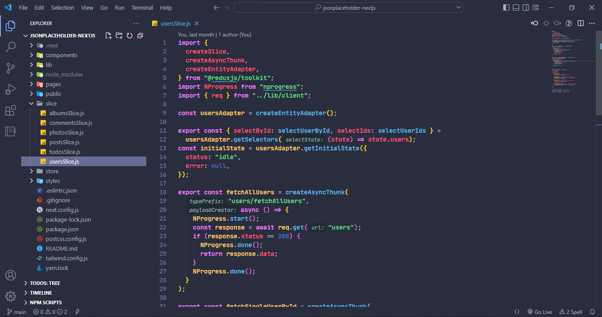

# omo-theme

  
      

## screenshot

### flat style

## I congratulate myself

This is my first plugin for vscode and this is not the last and I plan to come to you soon with more features

## License

[MIT](https://github.com/omoghadasi/omo-theme/LICENSE.md)
